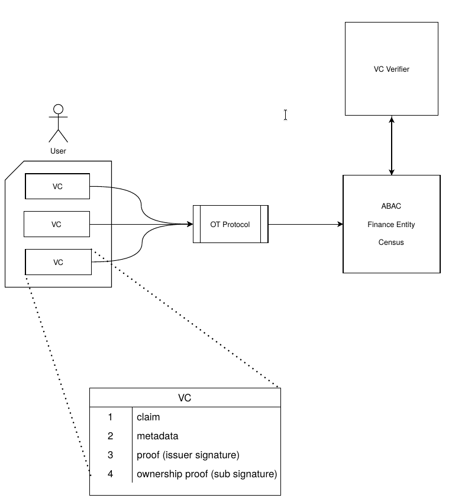

# SDOT

## Selective Disclosure of atomic credentials through Oblivious Transfer

A proof of concept protocol to exchange claims through OT (1-out of-n).

## Description

This project aims to approach the Selective Disclosure of Verified Credentials in a different way, normally Selective disclosure techniques allow a subject to release to a verifier a portion of the claims contained in a Verified Credential while still maintaining the ability for the Verifier to verify the VC. This means that the receiver can access all of the disclosed claims with no limitation, if the aforementioned needs a claim to verify a certain characteristic of the sender he is either free to access (within the disclosed claims) more that he would strictly need or be forced to base his verification process on one claim chosen by the sender which might not be sufficient. 

This solution provides a middle ground for this problem, here the sender can let the receiver choose freely among the disclosed claims, but it can choose only one claim. This tradeoff gives more flexibility to the receiver since he is now capable of choosing the claim he prefers (maybe one verified by an Issuer he trust more), while the sender is sure that no more than one claim is retrievable, protecting against possible **inference attacks** made by combining more disclosed claims together. 

It uses the OT protocol to transmit VC to a entity, this guarantees that: 

- the sender is not aware of the choice of the receiver. 

- the receiver cannot obtain more than one claim. 

- the receiver is free to choose one of the n claims offered by the protocol. 

  
 

Each individual VC is created in accordance with the "Atomic" selective disclosure method, that is every VC has one claim that the subject owns, instead of a single credential including all the claims. Therefore, the subject can select the subset of claims to include in their presentation by selecting the corresponding credentials. In this case however rather than sending them in a Verified Presentation we use them singularly, thus a new problem arises: each verified credential is signed by the Issuer that created said credential, this guarantees that the contained by the VC is true by having the Issuer vouching for the subject. However, nothing proves you own said credential, since it is signed, you could use someone else's pretending it is yours. The addition of a signature made with the private key associated to your Did allows the receiver to prove that the VC is indeed yours, by checking the "sub" field of the VC it is able to query the Did resolver in the blockchain and obtain the *DiD Document* that contain, among other things the subject's public key needed to verify the additional Digital Signature. The signature is protected against replay/reuse attacks using a nonce, an issuance and expiration timestamp of the signature and contextual information field indicating the intended receiver of the transaction. 
